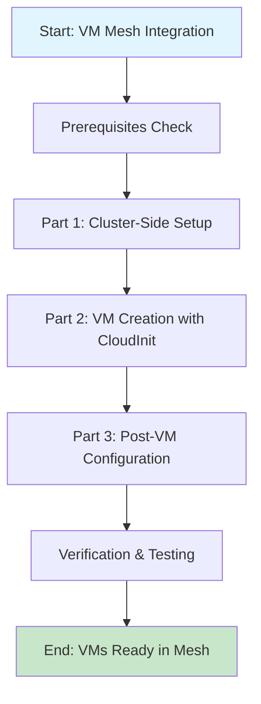
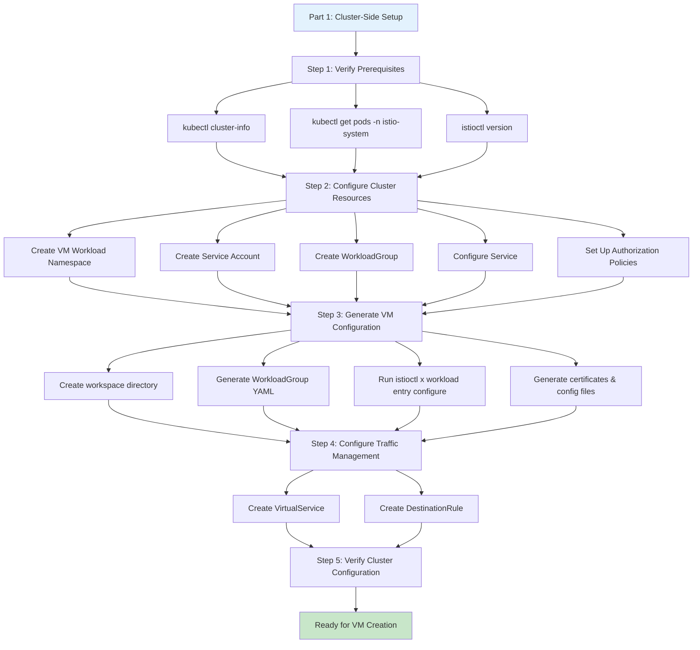
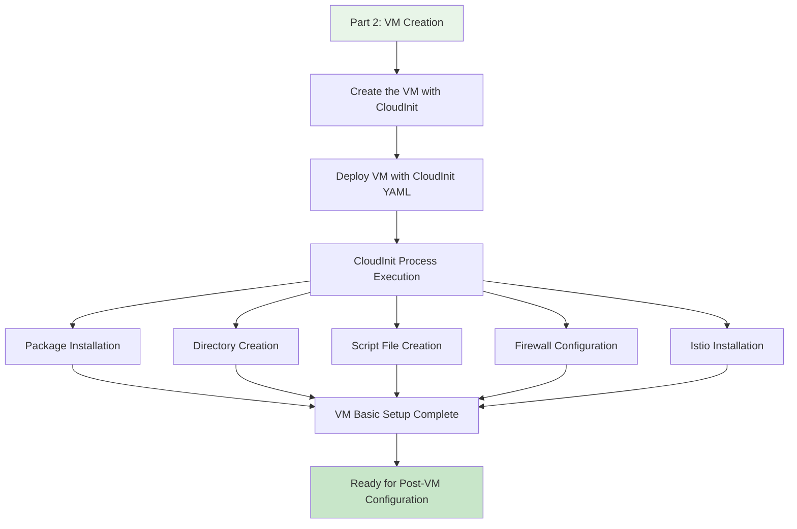
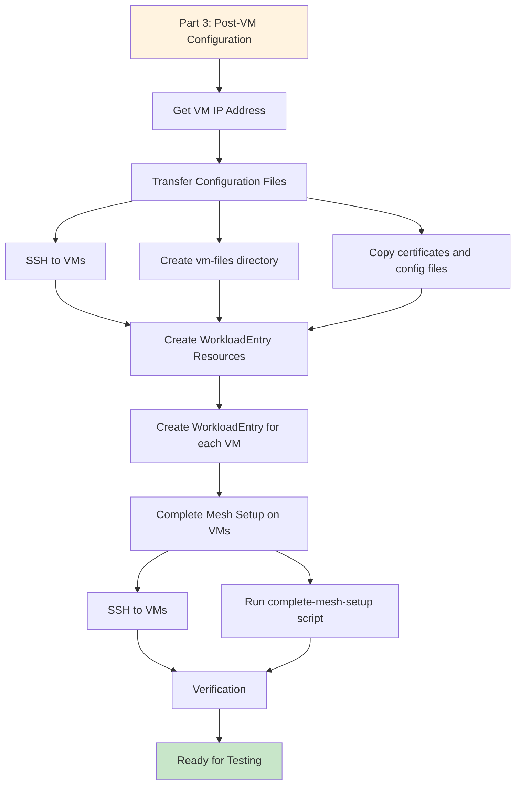
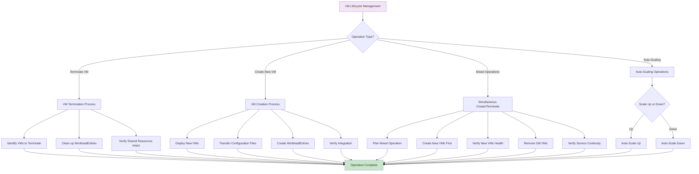
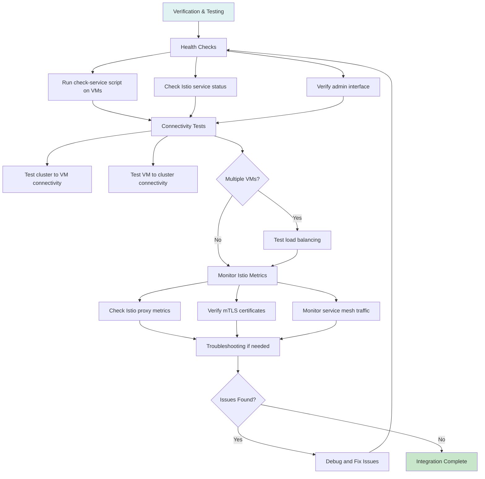
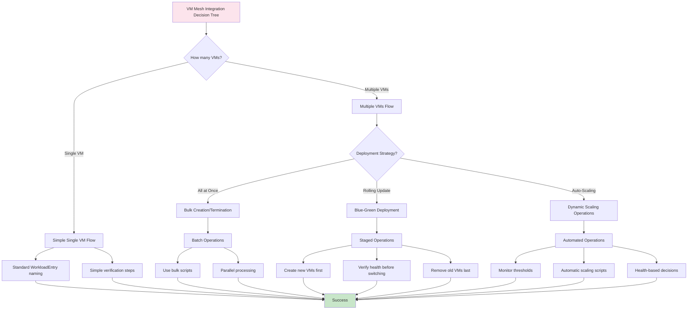
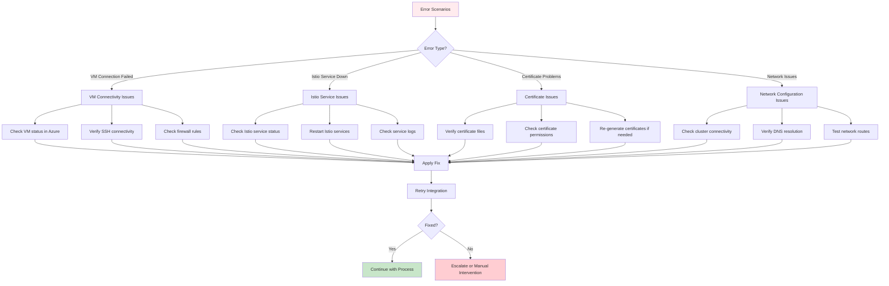
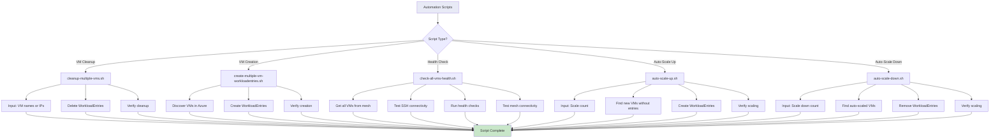

# VM Mesh Integration Flow Diagram

This document provides visual flow diagrams for the VM Mesh Integration process, covering both single VM and multiple VM scenarios.

## Overall Process Flow

## Part 1: Cluster-Side VM Mesh Integration Setup

## Part 2: VM Creation and CloudInit Process

## Part 3: Post-VM Configuration

## VM Lifecycle Management Flow

## Verification and Testing Flow

## Decision Points and Branching

## Error Handling and Recovery Flow

## Automation Scripts Workflow

## Summary

This flow diagram represents the complete VM Mesh Integration process with the following key phases:

1. **Cluster-Side Setup**: Configure Kubernetes cluster resources for VM integration
2. **VM Creation**: Deploy VMs with CloudInit configuration
3. **Post-VM Configuration**: Transfer certificates and create WorkloadEntries
4. **Verification**: Test connectivity and mesh integration
5. **Lifecycle Management**: Handle VM termination, creation, and scaling
6. **Error Handling**: Troubleshoot and recover from issues
7. **Automation**: Use scripts for bulk operations and scaling

The diagrams support both single VM and multiple VM scenarios, with specific flows for complex operations like blue-green deployments, auto-scaling, and mixed create/terminate operations.
